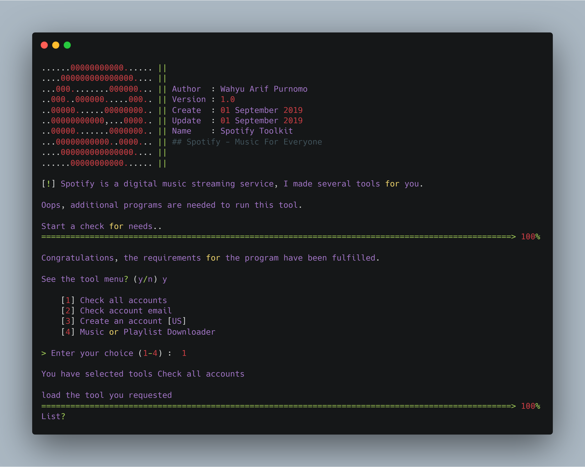

<H1 align="center">
SPOTIFY TOOLKIT
</H1>
<H4 align="center">
Spotify is a digital music streaming service, I made several tools for you. 
</H4>

 

Made with ❤️ by <a href="https://github.com/warifp">Wahyu Arif Purnomo</a>

<a>  VERSION 1.0  </a>
  

## Features in tools

| Name                               | Status             | Information                                        |
| ---------------------------------- | ------------------ | -------------------------------------------------- |
| Check all accounts                 | :white_check_mark: | get access token your facebook account             |
| Check account email                | :white_check_mark: | view your account information                      |
| Create an account                  | :white_check_mark: | retrieve all your friend's ID data                 |
| Music or Playlist Downloader       | :white_x_mark: | retrieve all your friend's Email data              |

## Version

Version 1.0 :

    sorry, no video tutorial.

  Changelog :

-   Build

## Installation

### Windows or Linux
You can download the latest composer in [here](https://getcomposer.org/download/).

    git clone https://github.com/warifp/SpotifyToolkit

    composer 
    
### Termux

    pkg install php

    pkg install curl

    pkg update

    git clone https://github.com/warifp/SpotifyToolkit

## Requirements for using this tool

We need several requirements to use this tool to run smoothly.

##### Linux

##### Windows

## Usage

Enough to execute the command :

    php run.php

and don't forget to ask at [issue page](https://github.com/warifp/SpotifyToolkit/issues)
If you have additional information, you can make it on the [issue page](https://github.com/warifp/SpotifyToolkit/issues).

## Thanks

Thank you for all.

1.  CLIMate Library : [CLIMate](https://climate.thephpleague.com/).
2.  ASCII Art Generator : [TAAG](http://patorjk.com/software/taag).

## Donation

    If you want to buy my coffee, you can send payments Paypal.

## Disclaimer

This is an open source for everyone, you may redistribute, modify, use patents and use privately without any obligation to redistribute. but it should be noted to include the source code of the library that was modified (not the source code of the entire program), include the license, include the original copyright of the author (warifp), and include any changes made (if modified). Users do not have the right to sue the creator when there is damage to the software or even demand if there is a problem caused by the makers of this tool. because every risk is caused by the user risk itself.
